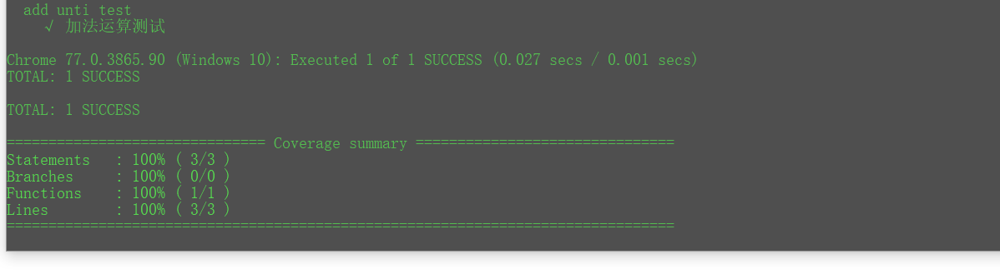

<!--
 * @Description: 
 * @version: 
 * @Author: lxw
 * @Date: 2020-04-10 19:24:25
 * @LastEditors: lxw
 * @LastEditTime: 2020-04-13 00:22:35
 -->

### 启动
```
npm install
npm run test
```

### 配置过程

#### 分两个步骤进行配置

1. karma工具的配置
> 具体的信息都以注释的形式写在了工程的karma配置文件了
> 注意相关依赖插件需要在karma配置文件的plugins属性配置
> 注意Mocah不包含断言，所以我们需要导入第三方断言库chai，如下单元测试脚本
```js
/*
 * @Description: 
 * @version: 
 * @Author: lxw
 * @Date: 2020-04-11 11:35:30
 * @LastEditors: lxw
 * @LastEditTime: 2020-04-11 12:16:34
 */
// 导入我们测试模块源码内部定义的函数
const add = require('../../src/libs/add.js');
const expect = require('chai').expect;


describe('add unti test', function () {
    it('2 + 3 = 5', () => {
        // 使用chai断言来判断add计算结果（作为输入）是否可以得到我们预期的结果（输出）
        let result = add(2,3);
        expect(result).to.equal(5);
    })  
})
```

2. webpack配置

#### karma 结合 webpack 实现自动化单元测试
> 本质比起传统的直接运行karma start启动浏览器执行元源代码进行测试，我们更需要的将源代码和测试代码通过 webpack 打包为一个文件，然后交给 karma 进行统一的测试。

> 为了将源代码和测试代码组合在一起，我们可以创建一个karma的入口文件，通过它来引用我们的源代码和单元测试代码，通过webpack将这个文件作为打包的入口来生成最早的脚本文件，然后由karma将这个文件交给单元测试环境执行，获取测试的结果。 怎么做呢，其实不难，这里需要注意这个入口文件是这些执行的我们启动karma通过karma配置`preprocessors: {'./karma-index.js': ['webpack', 'sourcemap']},`选项，它会先执行webpack进行编译打包，注意此时使用的是导入到karma.conf.js的webpack配置文件，没错我们如果项目如果需要测试环境的话我们还需要一个`webpack.test.conf.js`的专门针对测试的webpack配置文件，它最大的区别就是入口文件不一样。
> 测试源代码与测试脚本：其实怎么说呢？比如以你的实际项目的每一个js文件来说都是一个模块，如果这些模块都需要测试，那么你需要在test测试文件加下对应编写它们的单元测试脚本，所以对应结构还是很清晰的，只是编写脚本有点麻烦

> 示例目录、文件结构
- src项目业务代码，要被测试的源代码，比如add.js
- webpack.config.js:项目打包的webpack配置文件
- webpack.test.js: 项目测试的webpack配置文件
- test存放对应源代码的单元测试脚本,比如对应add.js模块的add.spec.js
- karma-index.js 作为测试webpack打包的入口文件，也作为配置在Karma的files属性值，启动karmawebpack从这里打包源代码和测试代码将其组合在一起。

#### karma运行测试用例，补充
- 新开一个窗口，运行`karma run`可以在终端看到浏览器执行结果
- karma run默认情况下会一次运行所有找到的测试用例，，有时候为了方便测试，我们可以执行如下命令，运行特点的测试用例。
```
$ karma run -- --grep 'A spec suite'
```
表示只运行匹配特定字符串A spec suite的测试用例。

#### mocha测试框架的若干运行命令

#### 单元测试代码覆盖率问题
1. 可以使用`karma-coverage`插件，但是我们测试入口文件是webpack打包入口文件，所以如果直接这样做的话，会把webpack生成的代码也加入到统计的总数中，导致覆盖率不准确，如下
```js
    // karma扩展的插件，启动后需要用到的，具体可以看karma的plugin相关文档。
    plugins: [
      'karma-chrome-launcher',
      'karma-webpack',
      'karma-mocha',
      'karma-chai',
      'karma-spec-reporter',
      'karma-coverage'
    ],
    preprocessors: {
      'karma-index.js': ['webpack','coverage']
    },
    reporters: ['spec', 'coverage'],
    // 生成代码测试覆盖率报告
    coverageReporter: {
    dir: './coverage',
    reporters: [
    { type: 'lcov', subdir: '.' },
    { type: 'text-summary' }
    ]
    },
```
##### 推荐的一种覆盖率统计实现如下
- 工具：`karma-coverage-istanbul-reporter + istanbul-instrumenter-loader`
- 配置:关键是webpack以及karma两个地方配置 [具体可以看webpack官方文档](http://webpack.html.cn/loaders/istanbul-instrumenter-loader.html)
1. webpack配置,注意`istanbul-instrumenter-loader`默认不支持es2015 模块化语法,需要如下配置开发它对babel的使用和支持module语法
```js
   // 用 Istanbul 只监测业务代码,include是你需要测试的源码，通过它以及你最终测试脚本统计代码覆盖率
    {
        test: /\.js$|\.jsx$/,
        use: {
            loader: 'istanbul-instrumenter-loader',
            options: { esModules: true } // 使其支持es2015 的mudule语法
        },
        enforce: 'post', // 使用babel，You must run the instrumentation as a post step
        exclude: /node_modules|\.spec\.js$/,
        include: path.resolve('src/libs')
    }
```
2. karma.conf.js
```js
// 需要依赖插件；karma-spec-reporter，karma-coverage,可以查看插件的相关文档来了解
     reporters: ['spec','coverage-istanbul'], 

    // 生成代码测试覆盖率报告
    coverageIstanbulReporter: {
      dir: './coverage',
      // 以什么格式, 这里设置了输出 html文件 ,info文件 ,及控制台
      reports: ['html', 'lcovonly', 'text-summary'],
      // 修正 weback 路径
      fixWebpackSourcePaths: true,
      // 将生成的html放到./coverage/html/下
      'report-config': {
        html: {
          subdir: 'html'
        }
      }
    },
```
测试`src/libs/add.js`模块,运行后如图


#### 测试用例的编写
> 单元测试用例的编写并不复杂，相当于另外编写了一套程序，关键是你要测试的对象是什么是业务逻辑.js模块还是结合交互的视图组件
1. 针对业务.js模块,一般是针对里面的方法,导入业务源码的相关的js模块,执行方法,利用断言来判断方法输出是否符合预期,
```js
/*
 * @Description: 
 * @version: 
 * @Author: lxw
 * @Date: 2020-04-11 11:35:30
 * @LastEditors: lxw
 * @LastEditTime: 2020-04-11 16:37:09
 */
// 导入我们测试模块源码内部定义的函数
const expect = require('chai').expect;
import {  add, minus } from "../../src/libs/add.js";


describe('add unti test', function () {
    it('加法运算测试', () => {
        // 使用chai断言来判断add计算结果（作为输入）是否可以得到我们预期的结果（输出）
        let result = add(2,3);
        expect(result).to.equal(5);
    })  
    it('减法运算测试', () => {
        let result = minus(5,10);
        expect(result).to.equal(-5);
    })
})
```
